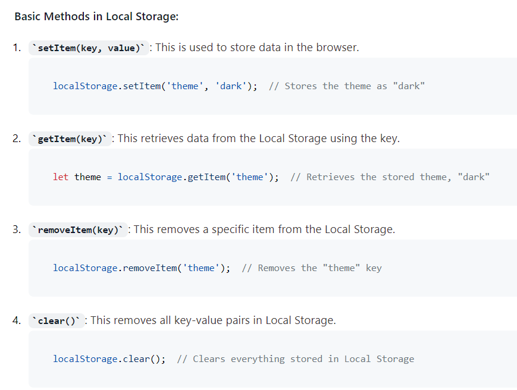
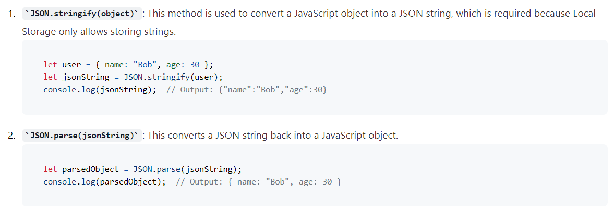

```
// Saving the user's name
localStorage.setItem('username', 'Alice');

// Retrieving the user's name when they revisit the page
let username = localStorage.getItem('username');
if (username) {
    console.log(`Welcome back, ${username}!`);
}
```

## Common Methods for Handling JSON:

