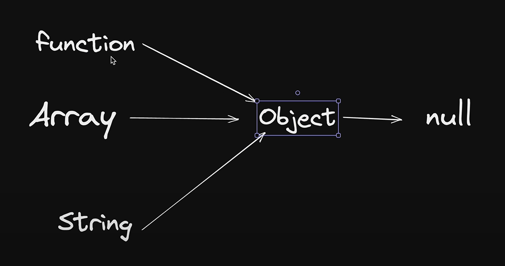
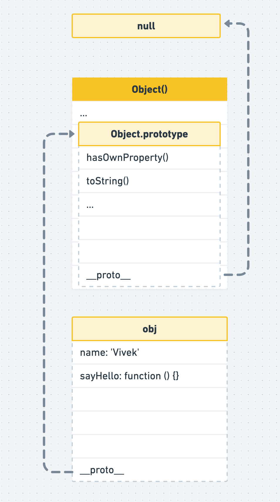
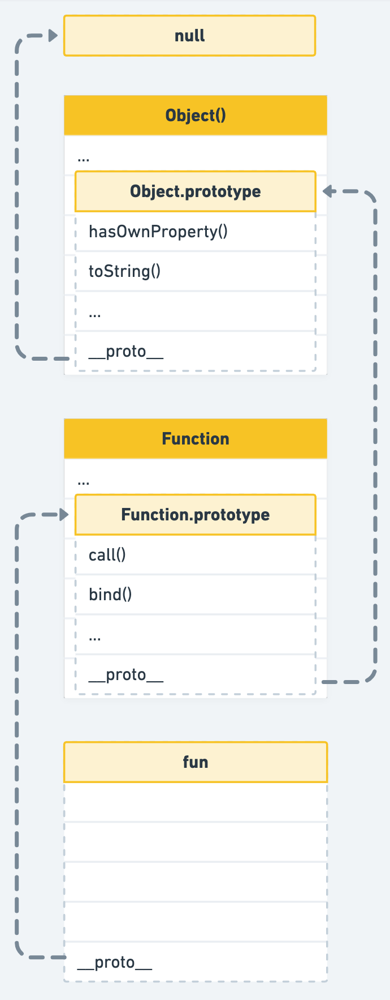
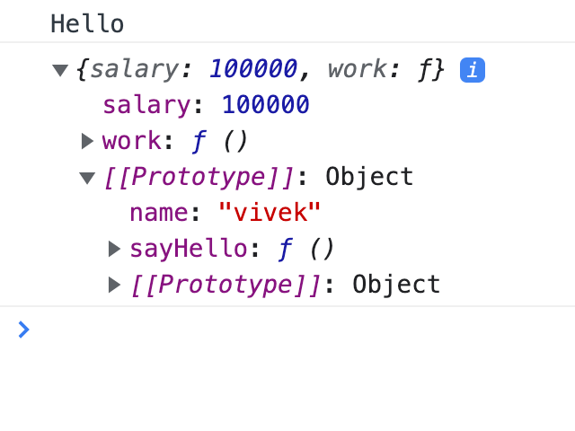
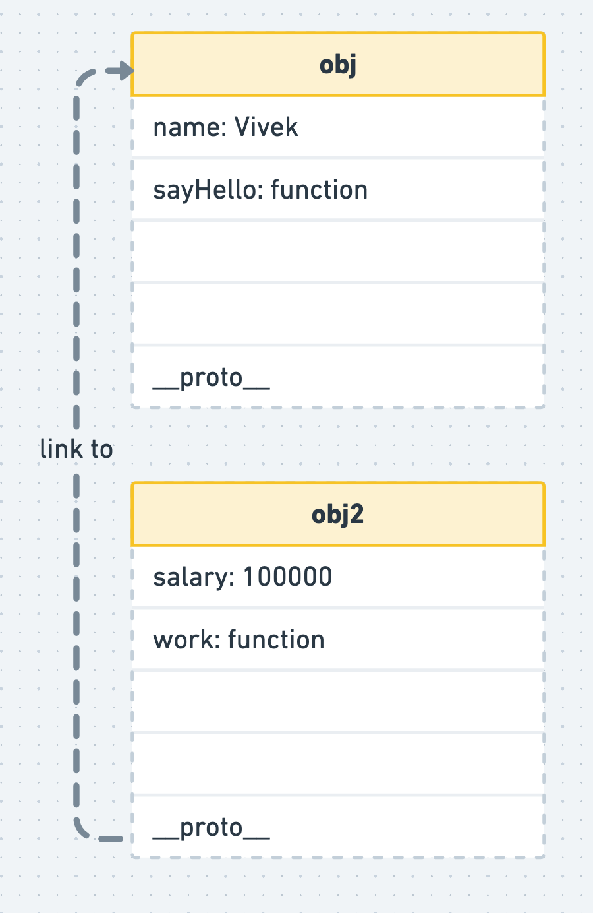

## `__Proto__` is used for linking while prototype for properties



## object
```
let obj = {
  name: "vivek",
  sayHello: function () {
    console.log("Hello");
  },
};


```


<!-- try on array -->

## array
let arr = ["one", "two", "three"];


## function
function fun() {}




# Two object linking
```
let obj = {
  name: "vivek",
  sayHello: function () {
    console.log("Hello");
  },
};

let obj2 = {
  salary: 100000,
  work: function () {
    console.log("Working");
  },
};

Object.setPrototypeOf(obj2, obj);

obj2.sayHello();

console.log(obj2);

```


```
obj2.__proto__ === obj; // true
```